+++
title = "Writeup by korami"
type = "writeups"
authors = ["korami"]
+++

## Writeup for obfuscator.re Challenge 1

The application has a simple login screen:



Checking the source code in jadx:

```bash
$ jadx-gui apks/challenge-pydroid.apk 2>&1 >/dev/null &
```
<br />

We see that the code behind the check is inside a native function:

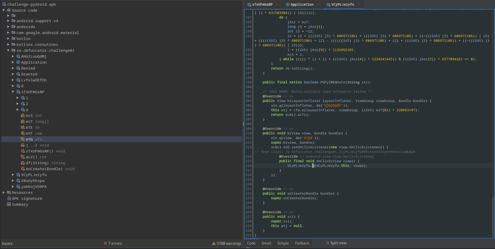

<br />

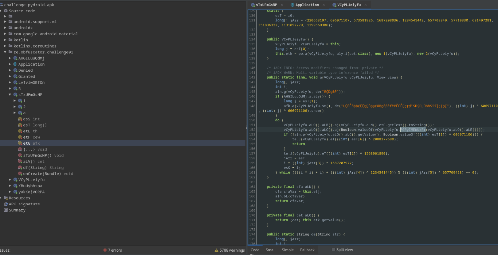

<br />

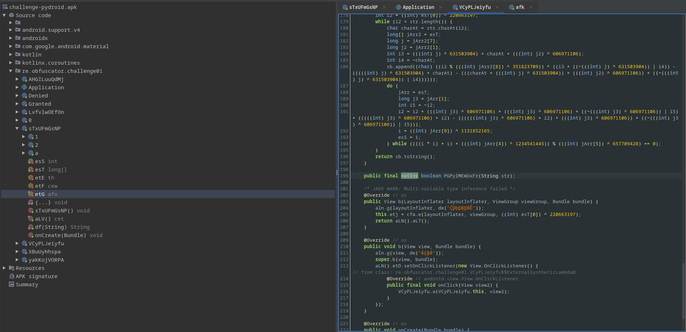

Installing the app and running frida:

```bash
$ adb install apks/challenge-pydroid.apk
```

<br />

Searching for `system.load` in jadx we can find where the lib is being loaded:
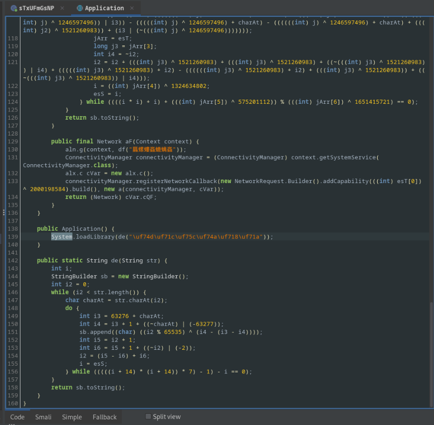

Let's write a script to decrypt the string and see what the name of the lib that is being loaded:

```javascript
Java.perform(function(){
    let Application = Java.use("re.obfuscator.challenge01.Application");
    console.log(Application["de"]("\uf74d\uf71c\uf75c\uf74a\uf718\uf71a"));
});
```
<br />

Injecting the script on boot:

```
$ frida -l decryptString.js -f re.obfuscator.challenge01 --no-pause
[Pixel 4 XL::re.obfuscator.challenge01 ]-> a1re03
```
<br />

It seems like the library name is  `a1re03`, since it's using the api call `system.loadLibrary` we should find a file with the prefix **lib** `liba1re03.so`:

```bash
$ apktool d apks/challenge-pydroid.apk -o challenge-pydroid
$ ls challenge-pydroid/lib/arm64-v8a
liba1re03.so
```
<br />

Openning the library in ghidra we can see and check the entrypoints, and we can see the `.init_array` is not initialised:



I tried to search for functions in the symbol-tree with the prefix `java_` but didn't find any, so I believe the linking between Java and the native code should be done with the `registerNatives` function somewhere in the `JNI_OnLoad` function:
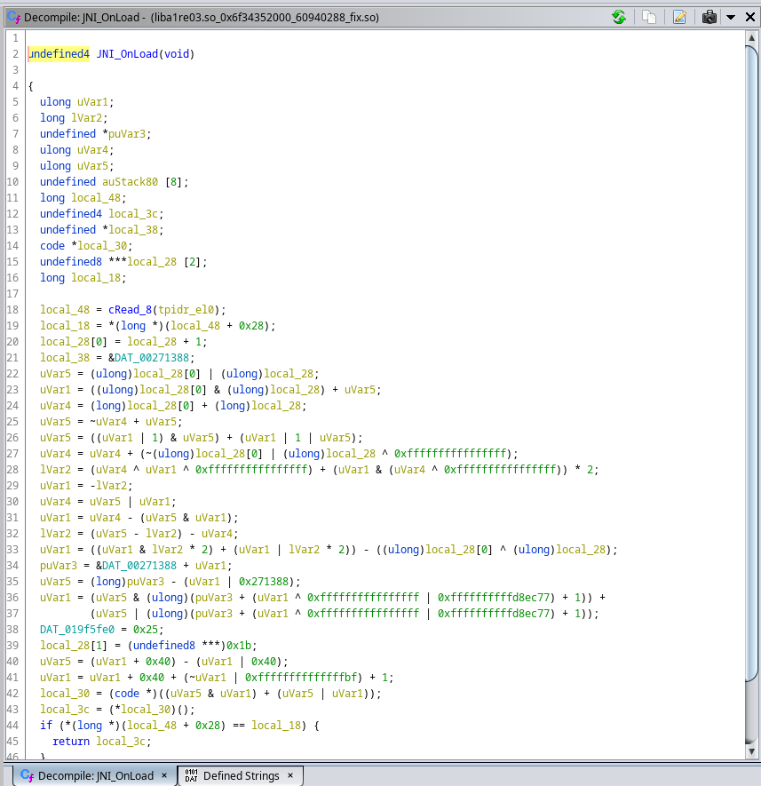

It seems like there will be an indirect call, so instead of diving into the code, I used jnitrace to trace the function `JNI->registerNatives` to locate in ghidra the respective code related to the native function in Java:

```bash
       /* TID 22199 */
239 ms [+] JNIEnv->RegisterNatives
239 ms |- JNIEnv*          : 0xb400007cb2c51df0
239 ms |- jclass           : 0x95    { re/obfuscator/challenge01/VCyPLJeiyfu }
239 ms |- JNINativeMethod* : 0x7febbf85c0
239 ms |:     0x7b66211428 - PGPyIMEWUxFr(Ljava/lang/String;)Z
239 ms |- jint             : 1
239 ms |= jint             : 0

239 ms --------------------------------Backtrace--------------------------------
239 ms |->       0x7b661ab0ac: liba1re03.so!0x1720ac (liba1re03.so:0x7b66039000)
239 ms |->       0x7b661ab0ac: liba1re03.so!0x1720ac (liba1re03.so:0x7b66039000)
```
<br />

We can see where register natives is being called at `0x1720ac`. To see the code in ghidra, we can just go to the address `0x1720ac + 0x100000`  (We need to add 100k because ghidra by default will load the lib at that address).

The logic we truly want to check on is the function `PGPyIMEWUxFr`, jnitrace will give us the base address of the lib and the address of the start of the function, so basically, to calculate its real offset in ghidra we could just do `0x7b66211428-0x7b66039000+0x100000 = 0x2d8428`.

A lot of functions are not decompiled in ghidra and didn't perform the backtrack references through the code, mostly because of some of the techniques used described [here](https://www.romainthomas.fr/publication/22-pst-the-poor-mans-obfuscator/whitepaper.pdf).

Due to this problem, I decided to dump the library from memory and [fix](https://github.com/F8LEFT/SoFixer/tree/master) the elf and in some way solve some of the problems generated by [this](https://www.romainthomas.fr/publication/22-pst-the-poor-mans-obfuscator/whitepaper.pdf), also we know omvll is based of o-llvm and some versions uses globals for the strings, based on experience the fastest way to circuvent string encryption for global variables is to use a dump, this is also described in the [documentation](https://obfuscator.re/omvll/passes/strings-encoding/).

We could write our own frida script to dump from memory, but to save time. There are already some scripts that perform the dump and fix the elf for us. One example of such is this [frida_dump](https://github.com/lasting-yang/frida_dump/blob/master/dump_so.py)

Perhaps we will encounter a problem while trying to dump (the code will dump the specified lib in the frontmost application):
```bash
$ python dump_so.py liba1re03.so
...
frida.core.RPCException: Error: access violation accessing 0x7b6cdcf000
    at <anonymous> (frida/runtime/core.js:138)
    at dumpmodule (/script1.js:12)
    at apply (native)
    at <anonymous> (frida/runtime/message-dispatcher.js:13)
    at c (frida/runtime/message-dispatcher.js:23)
```
<br />

Seems like there is a section of the lib that doesn't have read permissions, to solve this we must adapt the `dump_so.js` to change the memory region, also this line of code doesn't seem to fully work:

```javascript
...
Memory.protect(ptr(libso.base), libso.size, 'rwx');
...
```
<br />

If we investigate the address mapping:

```bash
$ adb shell "ps | grep -i 're.obfuscator.challenge01'"
u0_a282      22584  9119 15130452 373024 SyS_epoll_wait     0 S re.obfuscator.challenge01
$ adb shell "cat /proc/22584/maps | grep 'liba1re03.so'"
7b6b4d1000-7b6b910000 rwxp 00000000 fd:04 143995 /data/app/~~wo0sC2WdNe1hirJvBsr8gQ==/re.obfuscator.challenge01-jU98uNg4F1DuhOs3utp2zA==/lib/arm64/liba1re03.so
7b6b910000-7b6b919000 r--p 0043e000 fd:04 143995 /data/app/~~wo0sC2WdNe1hirJvBsr8gQ==/re.obfuscator.challenge01-jU98uNg4F1DuhOs3utp2zA==/lib/arm64/liba1re03.so
7b6b919000-7b6cdc7000 rw-p 00446000 fd:04 143995 /data/app/~~wo0sC2WdNe1hirJvBsr8gQ==/re.obfuscator.challenge01-jU98uNg4F1DuhOs3utp2zA==/lib/arm64/liba1re03.so
7b6edc6000-7b6eeef000 rwxp 018f5000 fd:04 143995 /data/app/~~wo0sC2WdNe1hirJvBsr8gQ==/re.obfuscator.challenge01-jU98uNg4F1DuhOs3utp2zA==/lib/arm64/liba1re03.so

```
<br />

Maybe because changing the entire permissions of lib may cause some problems to solve this, we just adapt that special region of memory and do this:

```javascript
Memory.protect(ptr(0x7b6cdcf000), libso.size-(0x7b6cdcf000-libso.base), 'rwx');
```
<br />

Since we are attaching to the process, we don't need to update the address `0x7b6cdcf000` but if you are trying to do the same, you will need to update your address depending on the error.

```bash
$ python dump_so.py liba1re03.so                                                                                                1 ⚙
{'name': 'liba1re03.so', 'base': '0x7b6b4d1000', 'size': 60940288, 'path': '/data/app/~~wo0sC2WdNe1hirJvBsr8gQ==/re.obfuscator.challenge01-jU98uNg4F1DuhOs3utp2zA==/lib/arm64/liba1re03.so'}
android/SoFixer64: 1 file pushed, 0 skipped. 22.3 MB/s (186656 bytes in 0.008s)
liba1re03.so.dump.so: 1 file pushed, 0 skipped. 37.3 MB/s (60940288 bytes in 1.558s)
adb shell /data/local/tmp/SoFixer -m 0x7b6b4d1000 -s /data/local/tmp/liba1re03.so.dump.so -o /data/local/tmp/liba1re03.so.dump.so.fix.so
[main_loop:87]start to rebuild elf file
[Load:69]dynamic segment have been found in loadable segment, argument baseso will be ignored.
[RebuildPhdr:25]=============LoadDynamicSectionFromBaseSource==========RebuildPhdr=========================
[RebuildPhdr:37]=====================RebuildPhdr End======================
[ReadSoInfo:549]=======================ReadSoInfo=========================
[ReadSoInfo:696]soname
[ReadSoInfo:699]Unused DT entry: type 0x6ffffffb arg 0x00000001
[ReadSoInfo:699]Unused DT entry: type 0x00000009 arg 0x00000018
[ReadSoInfo:699]Unused DT entry: type 0x6ffffff9 arg 0x00002d60
[ReadSoInfo:591] plt_rel (DT_JMPREL) found at 498a8
[ReadSoInfo:595] plt_rel_count (DT_PLTRELSZ) 549
[ReadSoInfo:584]symbol table found at 38f5000
[ReadSoInfo:580]string table found at 393b7a0
[ReadSoInfo:699]Unused DT entry: type 0x6ffffef5 arg 0x03a12219
[ReadSoInfo:629] constructors (DT_INIT_ARRAY) found at 445738
[ReadSoInfo:633] constructors (DT_INIT_ARRAYSZ) 13
[ReadSoInfo:637] destructors (DT_FINI_ARRAY) found at 445728
[ReadSoInfo:641] destructors (DT_FINI_ARRAYSZ) 2
[ReadSoInfo:699]Unused DT entry: type 0x6ffffff0 arg 0x03a0c421
[ReadSoInfo:699]Unused DT entry: type 0x6ffffffe arg 0x00003c68
[ReadSoInfo:699]Unused DT entry: type 0x6fffffff arg 0x00000003
[ReadSoInfo:703]=======================ReadSoInfo End=========================
[RebuildShdr:42]=======================RebuildShdr=========================
[RebuildShdr:536]=====================RebuildShdr End======================
[RebuildRelocs:783]=======================RebuildRelocs=========================
[RebuildRelocs:809]=======================RebuildRelocs End=======================
[RebuildFin:709]=======================try to finish file rebuild =========================
[RebuildFin:733]=======================End=========================
[main:123]Done!!!
/data/local/tmp/liba1re03.so.dump.so.fix.so: 1 file pulled, 0 skipped. 38.0 MB/s (60941163 bytes in 1.528s)
liba1re03.so_0x7b6b4d1000_60940288_fix.so
```
<br />

Now if we view .init_array section we can see a bunch of pointers to functions that will initialize globals and important stuff for the lib:
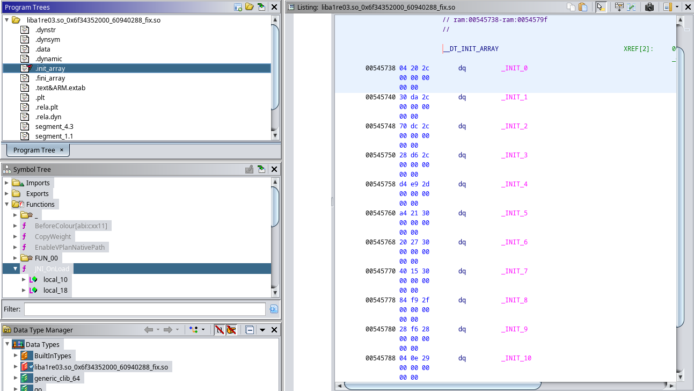

`_INIT_4` seems to have some python code related to the flag:
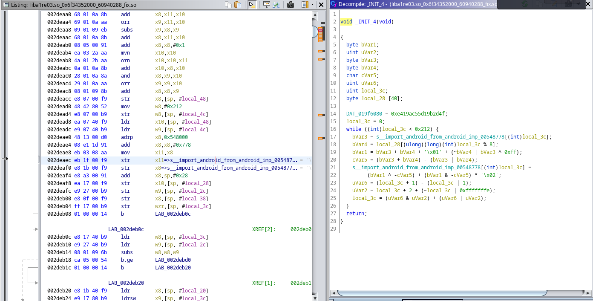

Extracting the code from the string we get:

```python
import android
from android import decode, hash
import json
data = json.loads(json_data)
login, password = data

login    = decode(login)
password = decode(password)

flag = login + password
h = hash(flag).hex()
if h != android.__FLAG__:
  android.print("Humm it looks like, it's not the good flag ...")
  android.print("It should be {} while it is {}".format(android.__FLAG__, h))
else:
  android.print("Well done!")
  is_valid = True
```
<br />

It seems flag check is being done here, and the flag is the combination of login and password, looks like the function `hash` is from a custom module named `android`, for now we still don't know what is the value of android.\_\_FLAG\_\_ and what the function `hash` does, but if look into `adb logcat` we can actually see the function `print` is just some logging function which will appear in the logcat:

```bash
adb shell logcat | grep 'omvll'
07-23 00:34:09.465 23655 23655 I omvll   : Humm it looks like, it's not the good flag ...
07-23 00:34:09.465 23655 23655 I omvll   : It should be f5ca458deb9629a74d4b0c3669deb5078a6a85a90afba9a3c76f5306a4bafb06 while it is e3b0c44298fc1c149afbf4c8996fb92427ae41e4649b934ca495991b7852b855
```
<br />

It looks like the concatenation of the login and password should be `e3b0c44298fc1c149afbf4c8996fb92427ae41e4649b934ca495991b7852b855` after applying the hash function, from the size of the hash it looks like this is some kind of sha256 but we need confirmation.

We could try to look in the native lib where the module is being initiated or loaded, but since we know that the global variable is located at `0x548778 - 0x100000` we can just write a frida script and inject our own python code to inspect this module!

```javascript
var libname = "liba1re03.so";
var moduleBaseAddress = Module.findBaseAddress(libname);
var ghidra_base = 0x100000;
const inject_python = `import android
from android import decode, hash
android.print(hash.__doc__)`;
const python_addr = moduleBaseAddress.add(0x548778-ghidra_base);
python_addr.writeUtf8String(inject_python);
```
<br />

The output:
```bash
$ echo -n 'abc' | sha256sum
ba7816bf8f01cfea414140de5dae2223b00361a396177a9cb410ff61f20015ad
$ frida -Ul inj_k.js -F --no-pause
$ adb shell logcat | grep 'omvll' # login in the app to trigger the print
07-23 01:54:37.928 24105 24105 I omvll   : ba7816bf8f01cfea414140de5dae2223b00361a396177a9cb410ff61f20015ad
```
<br />

This confirms that we indeed are dealing with sha256 hash. When I got this confirmation, I said to myself that there is no way this challenge is to bruteforce the login and password with a dictionary attack or something. I started to believe that maybe the dev left something within the custom `android` module that is not being used in the main script that could give us some tips about how the hash got generated or something:

```javascript
var libname = "liba1re03.so";
var moduleBaseAddress = Module.findBaseAddress(libname);
var ghidra_base = 0x100000;
const inject_python = `import android
from android import decode, hash
android.print(str(dir(android)))`;
const python_addr = moduleBaseAddress.add(0x548778-ghidra_base);
python_addr.writeUtf8String(inject_python);
```
<br />

And we saw 3 interesting fields `MvtKNJXCOGJe`, `__bc__` and `__doc__`.
```bash
07-23 15:28:56.809 27698 27698 I omvll   : ['MvtKNJXCOGJe', '__FLAG__', '__bc__', '__doc__', '__loader__', '__name__', '__package__', '__spec__', 'decode', 'hash', 'print']
```
<br />

`MvtKNJXCOGJe` is a function that receives a string and returns bytes:

```javascript
android.print(str(android.MvtKNJXCOGJe.__doc__));
```
<br />

The documentation of the function:

```bash
I omvll   : MvtKNJXCOGJe(arg0: str) -> bytes
```
<br />

`__bc__` seems to be a sequence of python bytecode which, after removing the new lines and decode hex data we get something very similar to a pyc file ? (header seems to be different and decompilers won't work)

```js
android.print(str(android.__bc__));
```
<br />

```bash
7-23 21:24:54.840 29800 29800 I omvll   :     700d0d0a000000004aaf626335010000e300000000000000000000000000000000040000004
07-23 21:24:54.840 29800 29800 I omvll   :     00000007338000000640064016d005a00640064016d015a0164026502640365036604640464
07-23 21:24:54.840 29800 29800 I omvll   :     0583045a04640265026403650366046406640783045a05640153002908e9000000004eda046
...
```
<br />

`__doc__` This contains some hash similar to the sha256 but we don't know yet for what it used.

```javascript
android.print(str(android.__doc__));
```
<br />

```bash
07-23 21:25:44.407 29800 29800 I omvll   : 9c16a9c3017d2b3876323bc4f9dad2b7530c
```
<br />

My next step was to see what code is behind `MvtKNJXCOGJe` we tried using the built-in module `dis` to get the disassemble code but it seems the function returns an error:

```bash
Abort message: 'terminating with uncaught exception of type pybind11::error_already_set: TypeError: don't know how to disassemble builtin_function_or_method objects
```
<br />

This means that this module is being loaded in the native code using cpython or pybind11.

To understand a little better I did some research on google and I learned that you could create a python module using cpython like this:

```c
#include <Python.h>

static char* __flag__ = "f0d15e5bb173d9a281cfaf2a2b01779a7e78c2b24a48f2cc74563b235c4c5b9b";

// Module method table
static PyMethodDef AndroidMethods[] = {
    {NULL, NULL, 0, NULL}
};

// Module definition
static struct PyModuleDef androidmodule = {
    PyModuleDef_HEAD_INIT,
    "android",
    NULL,
    -1,
    AndroidMethods
};

// Module initialization function
PyMODINIT_FUNC PyInit_android(void) {
    PyObject* module = PyModule_Create(&androidmodule);

    // Add the __flag__ variable to the module
    PyObject* flag = Py_BuildValue("s", __flag__);
    if (flag) {
        PyModule_AddObject(module, "__flag__", flag);
    }

    return module;
}
```
<br />

In a main program we could do something like this:
```c
#include <Python.h>

// Declare the init function for the "android" module
extern PyObject* PyInit_android(void);

int main(int argc, char* argv[]) {
    // Initialize the Python interpreter
    Py_Initialize();

    // Add the "android" module to the pyinittab
    PyImport_AppendInittab("android", &PyInit_android);

    // Start the interpreter
    Py_Main(argc, argv);

    // Finalize the Python interpreter
    Py_Finalize();

    return 0;
}
```
<br />

After running:

```bash
$ ./interpreter
Python 3.6.9 (default, Jul 23 2023, 00:00:00)
[GCC 8.4.0] on linux
Type "help", "copyright", "credits" or "license" for more information.
>>> import android
>>> print(android.__flag__)
'f0d15e5bb173d9a281cfaf2a2b01779a7e78c2b24a48f2cc74563b235c4c5b9b'
```
<br />

A good strategy here is to actually find where the string "android" is being called in the android code:
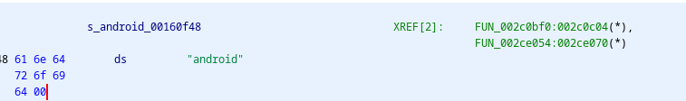

This already looks promissing:
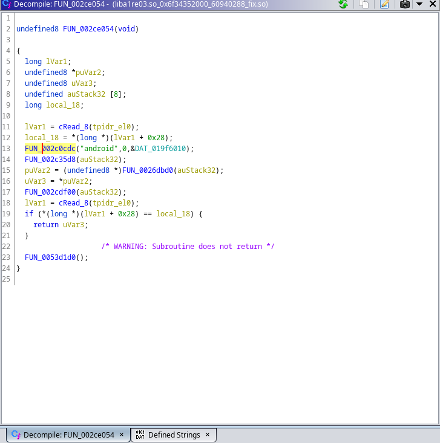

Diving in FUN_00280c08 we can see that there is a function that looks like is adding somekind of variable `__flag__` to the module:
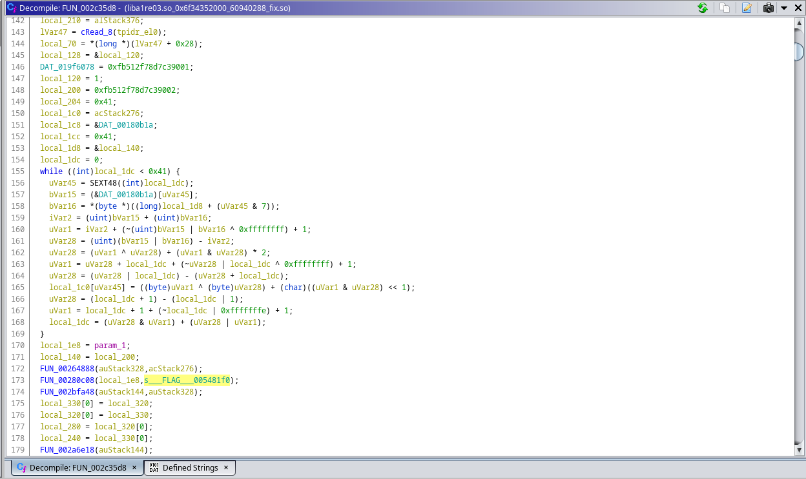

Searching for xrefs to those functions lead me to more assignments of `__bc__`  and `__doc__`:
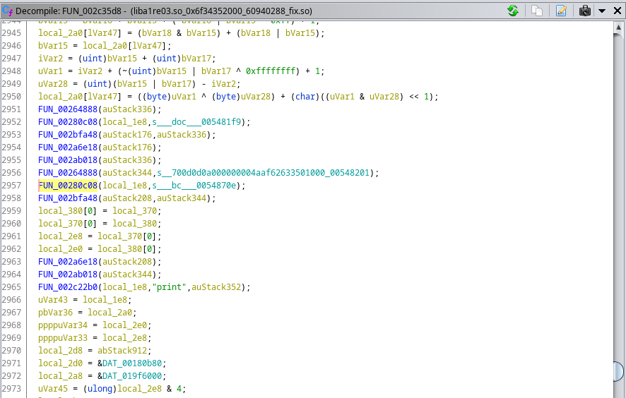

But the most important one was the function `FUN_002c22b0` contains the print string, which probably means that this function might be responsible for function attribution,
searching for xrefs didn't find anything which means this is probably some kind of proxy call, so we might need to check some of the internal calls:
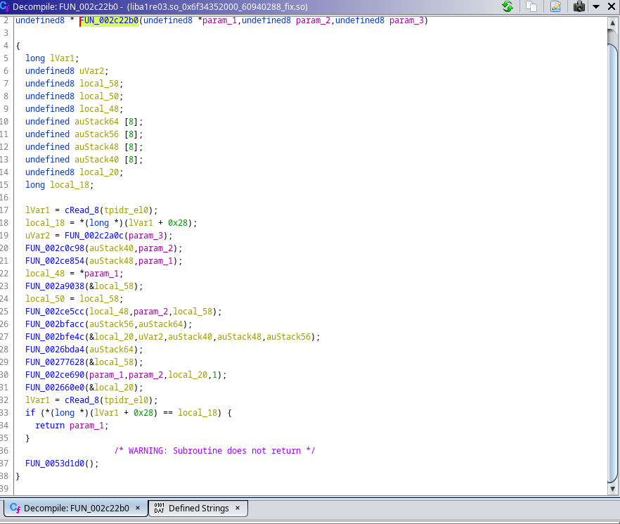

Searching for `MvtKNJXCOGJe` I didn't find anything, so this means that the author might have used `StringEncOptStack` instead of `StringEncOptGlobal` to hide this string, so I assumed that these internal functions are related to function attributions to the python module, probably related to pybind11 so I decided to hook `FUN_002ce5cc` we know that the second parameter is the name of the function and the 3rd is most likely the pointer to the function definition so we can write a frida script to hook this:

```javascript
var do_dlopen = null;
var call_ctor = null;
var moduleBaseAddress = null;
var hooked = false;
var libname = "liba1re03.so";
var ghidra_base = 0x100000;

Process.findModuleByName(Process.pointerSize === 4 ? 'linker' : 'linker64').enumerateSymbols().forEach(function (sym) {
  if (sym.name.indexOf('do_dlopen') >= 0) {
    do_dlopen = sym.address;
  } else if (sym.name.indexOf('call_constructor') >= 0) {
    call_ctor = sym.address;
  }
});
Interceptor.attach(do_dlopen,{
  onEnter: function(args){
    var soName = args[0].readCString();
    var temp = soName.split("/").pop();
    this.libname = temp;
    if (temp.indexOf(libname) > -1) {
      Interceptor.attach(call_ctor, function () {
        if(hooked == false) {
          moduleBaseAddress = Module.findBaseAddress(temp);
          hooked = true;
          before_init_initarray(temp);
        }
      });
    }
  },
  onLeave: function(retval){
    if (this.libname.includes(libname)) {
      after_init_initarray(this.libname);
    }
  }
});


function before_init_initarray(libname){
  Interceptor.attach(moduleBaseAddress.add(0x2ce5cc-ghidra_base),{
    onEnter: function(args){
      console.log(args[1].readCString() + " " + args[2]);
      console.log('called from:\n' +
        Thread.backtrace(this.context, Backtracer.ACCURATE)
        .map(DebugSymbol.fromAddress).join('\n') + '\n');
    },
    onLeave: function(retval){
    }});
}

function after_init_initarray(libname){}
```
<br />

The code above is not entirely necessary. I added this in case you want to hook something before some function in .init_array executes. This involves hooking some android linker functions and stuff, but it's not necessary if you really want, you could just attach to the app and only contain the code inside of before_init_initarray function.

```bash
$ frida -Ul inj_k2.js -f re.obfuscator.challenge01 --no-pause
# prints will only trigger after performing the login in the app
[Pixel 4 XL::re.obfuscator.challenge01 ]->
print
called from:
0x7b6449033c liba1re03.so!0x1c233c
0x7b6449033c liba1re03.so!0x1c233c

MvtKNJXCOGJe
called from:
0x7b644904c4 liba1re03.so!0x1c24c4
0x7b644904c4 liba1re03.so!0x1c24c4

decode
called from:
0x7b644911f8 liba1re03.so!0x1c31f8
0x7b644911f8 liba1re03.so!0x1c31f8

hash
called from:
0x7b644907bc liba1re03.so!0x1c27bc
0x7b644907bc liba1re03.so!0x1c27bc
```
<br />

Looking at the address call `0x1c24c4 + 0x100000` in ghidra:
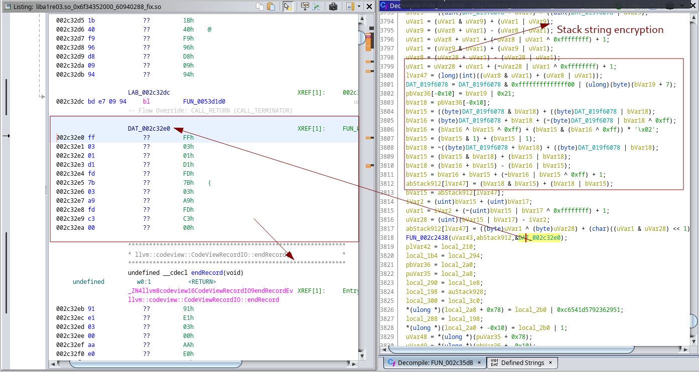

If we instruct ghidra to disassemble the code:
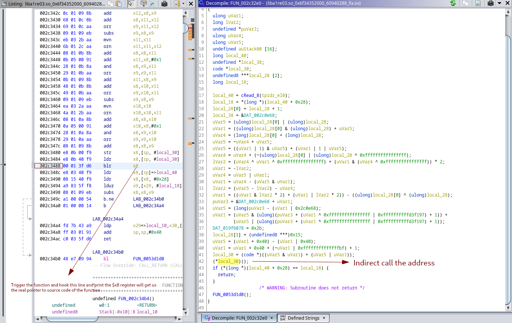

Let's hook that line and trigger the call by injecting python:

```javascript
var libname = "liba1re03.so";
var moduleBaseAddress = Module.findBaseAddress(libname);
var ghidra_base = 0x100000;

// on blr x8 to get the function pointer to the indirect call
Interceptor.attach(moduleBaseAddress.add(0x2c3488-ghidra_base),{
  onEnter: function(args){
    console.log(this.context.x8.sub(moduleBaseAddress).add(ghidra_base));
  },
  onLeave: function(retval){
  }
});

const inject_python = `import android
android.MvtKNJXCOGJe('abc')`;
const python_addr = moduleBaseAddress.add(0x548778-ghidra_base);
python_addr.writeUtf8String(inject_python);
```
<br />

We get the address:

```bash
$ frida -Ul inj_k2.js -F --no-pause
# print will trigger only after trying to login
[Pixel 4 XL::Open-Obfuscator Challenge ]-> 0x2c0ea8
```
<br />

After disassembling the function, we get a huge function:
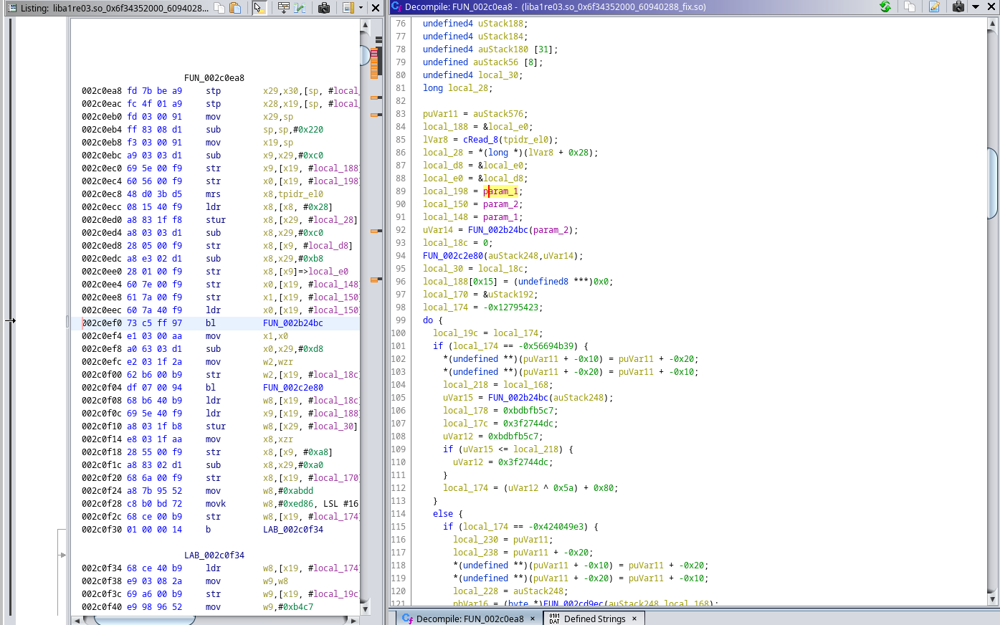

I didn't want to dive in into this function before understanding the context of this, I could end up reversing an entire function for nothing. So, after analysing the application with more attention, we noticed some files that were dropped into the cache folder `/data/data/re.obfuscator.challenge01/cache`:

```bash
$ adb shell "ls /data/data/re.obfuscator.challenge01/cache/WebView/Default/Web3"                                                1 ⚙
LICENSE.txt
__future__.py
__phello__.foo.py
__pycache__
_aix_support.py
_bootsubprocess.py
_collections_abc.py
_compat_pickle.py
_compression.py
_markupbase.py
_osx_support.py
_py_abc.py
_pydecimal.py
_pyio.py
_sitebuiltins.py
_strptime.py
_sysconfigdata__linux_aarch64-linux-android.py
_threading_local.py
_weakrefset.py
...
```
<br />

By reading the license file, we realized this seems to be the source code of python. Some of the files here are python built-ins. After finding this, we pulled the folder:
```bash
$ adb pull /data/data/re.obfuscator.challenge01/cache/WebView
```
<br />

By searching for one of the strange variables we found in android module with recursive grep, we found it was referenced in one of the files:

```bash
$ grep -ria '__bc__' WebView
WebView/Default/Web3/pyloader.py:        return bytes.fromhex(android.__bc__.replace("\n", "").strip().replace(" ", ""))
```
<br />

The python file:

```python
import importlib
from importlib.machinery import SourcelessFileLoader
from importlib.util import spec_from_file_location
import sys
import android

class FileLoader(SourcelessFileLoader):
    def __init__(self):
        super().__init__("checker", "checker.cpython-310.pyc")

    def get_data(self, path: str):
        return bytes.fromhex(android.__bc__.replace("\n", "").strip().replace(" ", ""))


def import_checker():
    loader = FileLoader()
    spec = spec_from_file_location('checker', "checker.cpython-310.pyc",loader=loader)
    module = importlib._bootstrap._load(spec)
    sys.modules['checker'] = module
    return module
```
<br />

Looks like the `__bc__` is a hidden module, like I said before we tried before to decompile this specific variable, but it looks like Romain Thomas did change the python source code, making it harder for us to recover the original code. Running this code on our machine also wouldn't work because of these modifications. The bytecode would throw errors, then I had the idea of actually injecting this code into the interpreter in the application like we did before for other purposes, then we could list all objects in the module and maybe use the builtin `dis` on the functions to view a better representation of the bytecode:

```javascript
var libname = "liba1re03.so";
var moduleBaseAddress = Module.findBaseAddress(libname);
var ghidra_base = 0x100000;
const inject_python = `import importlib
from importlib.machinery import SourcelessFileLoader
from importlib.util import spec_from_file_location
import sys
import android,dis,string

class FileLoader(SourcelessFileLoader):
    def __init__(self):
        super().__init__("checker", "checker.cpython-310.pyc")

    def get_data(self, path: str):
        import android
        return bytes.fromhex(android.__bc__.replace("\\n", "").strip().replace(" ", ""))

loader = FileLoader()
spec = spec_from_file_location('checker', "checker.cpython-310.pyc",loader=loader)
module = importlib._bootstrap._load(spec)

android.print(str(dir(module)))

const python_addr = moduleBaseAddress.add(0x548778-ghidra_base);
python_addr.writeUtf8String(inject_python);
```
<br />

```bash
$ adb logcat | grep 'omvll'
07-24 01:35:30.516 31523 31523 I omvll   : ['__builtins__', '__cached__', '__doc__', '__file__', '__loader__', '__name__', '__package__', '__spec__', 'android', 'check', 'json', 'verify']

```
<br />

I found this interesting function named `check`, so let's use `dis` to disassemble the function and view the code:
```javascript
var libname = "liba1re03.so";
var moduleBaseAddress = Module.findBaseAddress(libname);
var ghidra_base = 0x100000;
const inject_python = `import importlib
from importlib.machinery import SourcelessFileLoader
from importlib.util import spec_from_file_location
import sys
import android,dis,string

class FileLoader(SourcelessFileLoader):
    def __init__(self):
        super().__init__("checker", "checker.cpython-310.pyc")

    def get_data(self, path: str):
        import android
        return bytes.fromhex(android.__bc__.replace("\\n", "").strip().replace(" ", ""))

loader = FileLoader()
spec = spec_from_file_location('checker', "checker.cpython-310.pyc",loader=loader)
module = importlib._bootstrap._load(spec)

def get_instruction_repr(instruction):
    import dis
    opcode, arg, lineno = instruction.opname,instruction.argval, instruction.starts_line
    if instruction.arg is not None:
        arg_str = f" {arg}"
        return f"{lineno}: {opcode}{arg_str}"
    else:
        return f"{lineno}: {opcode}"
bytecode = dis.Bytecode(module.check)
for instruction in bytecode:
    android.print(get_instruction_repr(instruction))
android.print("android.__doc__ -> "+android.__doc__)
`;


const python_addr = moduleBaseAddress.add(0x548778-ghidra_base);
python_addr.writeUtf8String(inject_python);
```
<br />

The code is very simple to understand and we can see a very similar code to the code we saw in the global string comparison with the sha256 hash:
```bash
07-24 01:35:30.516 31523 31523 I omvll   : 5: LOAD_GLOBAL json
07-24 01:35:30.516 31523 31523 I omvll   : None: LOAD_METHOD_ENC loads
07-24 01:35:30.516 31523 31523 I omvll   : None: LOAD_FAST data
07-24 01:35:30.516 31523 31523 I omvll   : None: CALL_METHOD 1
07-24 01:35:30.516 31523 31523 I omvll   : None: UNPACK_SEQUENCE 2
07-24 01:35:30.516 31523 31523 I omvll   : None: STORE_FAST login
07-24 01:35:30.516 31523 31523 I omvll   : None: STORE_FAST password
07-24 01:35:30.516 31523 31523 I omvll   : 6: LOAD_GLOBAL android
07-24 01:35:30.516 31523 31523 I omvll   : None: LOAD_METHOD_ENC decode
07-24 01:35:30.516 31523 31523 I omvll   : None: LOAD_FAST login
07-24 01:35:30.516 31523 31523 I omvll   : None: CALL_METHOD 1
07-24 01:35:30.516 31523 31523 I omvll   : None: STORE_FAST login
07-24 01:35:30.517 31523 31523 I omvll   : 7: LOAD_GLOBAL android
07-24 01:35:30.517 31523 31523 I omvll   : None: LOAD_METHOD_ENC decode
07-24 01:35:30.517 31523 31523 I omvll   : None: LOAD_FAST password
07-24 01:35:30.517 31523 31523 I omvll   : None: CALL_METHOD 1
07-24 01:35:30.517 31523 31523 I omvll   : None: STORE_FAST password
07-24 01:35:30.517 31523 31523 I omvll   : 8: LOAD_GLOBAL android
07-24 01:35:30.517 31523 31523 I omvll   : None: LOAD_METHOD_ENC __obfuscated__
07-24 01:35:30.517 31523 31523 I omvll   : None: LOAD_FAST login
07-24 01:35:30.517 31523 31523 I omvll   : None: LOAD_FAST password
07-24 01:35:30.517 31523 31523 I omvll   : None: BINARY_ADD
07-24 01:35:30.517 31523 31523 I omvll   : None: CALL_METHOD 1
07-24 01:35:30.517 31523 31523 I omvll   : None: LOAD_METHOD_ENC hex
07-24 01:35:30.517 31523 31523 I omvll   : None: CALL_METHOD 0
07-24 01:35:30.517 31523 31523 I omvll   : None: LOAD_GLOBAL android
07-24 01:35:30.517 31523 31523 I omvll   : None: LOAD_ATTR __doc__
07-24 01:35:30.517 31523 31523 I omvll   : None: COMPARE_OP ==
07-24 01:35:30.517 31523 31523 I omvll   : None: RETURN_VALUE
07-24 01:38:36.452 31523 31523 I omvll   : 5: LOAD_GLOBAL json
07-24 01:38:36.453 31523 31523 I omvll   : None: LOAD_METHOD_ENC loads
07-24 01:38:36.453 31523 31523 I omvll   : None: LOAD_FAST data
07-24 01:38:36.453 31523 31523 I omvll   : None: CALL_METHOD 1
07-24 01:38:36.453 31523 31523 I omvll   : None: UNPACK_SEQUENCE 2
07-24 01:38:36.453 31523 31523 I omvll   : None: STORE_FAST login
07-24 01:38:36.453 31523 31523 I omvll   : None: STORE_FAST password
07-24 01:38:36.453 31523 31523 I omvll   : 6: LOAD_GLOBAL android
07-24 01:38:36.453 31523 31523 I omvll   : None: LOAD_METHOD_ENC decode
07-24 01:38:36.453 31523 31523 I omvll   : None: LOAD_FAST login
07-24 01:38:36.453 31523 31523 I omvll   : None: CALL_METHOD 1
07-24 01:38:36.453 31523 31523 I omvll   : None: STORE_FAST login
07-24 01:38:36.453 31523 31523 I omvll   : 7: LOAD_GLOBAL android
07-24 01:38:36.453 31523 31523 I omvll   : None: LOAD_METHOD_ENC decode
07-24 01:38:36.453 31523 31523 I omvll   : None: LOAD_FAST password
07-24 01:38:36.453 31523 31523 I omvll   : None: CALL_METHOD 1
07-24 01:38:36.453 31523 31523 I omvll   : None: STORE_FAST password
07-24 01:38:36.453 31523 31523 I omvll   : 8: LOAD_GLOBAL android
07-24 01:38:36.453 31523 31523 I omvll   : None: LOAD_METHOD_ENC __obfuscated__
07-24 01:38:36.453 31523 31523 I omvll   : None: LOAD_FAST login
07-24 01:38:36.453 31523 31523 I omvll   : None: LOAD_FAST password
07-24 01:38:36.453 31523 31523 I omvll   : None: BINARY_ADD
07-24 01:38:36.453 31523 31523 I omvll   : None: CALL_METHOD 1
07-24 01:38:36.453 31523 31523 I omvll   : None: LOAD_METHOD_ENC hex
07-24 01:38:36.454 31523 31523 I omvll   : None: CALL_METHOD 0
07-24 01:38:36.454 31523 31523 I omvll   : None: LOAD_GLOBAL android
07-24 01:38:36.454 31523 31523 I omvll   : None: LOAD_ATTR __doc__
07-24 01:38:36.454 31523 31523 I omvll   : None: COMPARE_OP ==
07-24 01:38:36.454 31523 31523 I omvll   : None: RETURN_VALUE
07-24 01:38:36.454 31523 31523 I omvll   : android.__doc__ -> 9c16a9c3017d2b3876323bc4f9dad2b7530c
```
<br />

The most important part is the fact the function is using a function `__obfuscated__` which we believe to be the same as `MvtKNJXCOGJe` and, instead of comparing the input with `android.__flag__` it will compare with `android.__doc__` which was the hash we didn't know what was its purpose.

Again, before going deep into the native code of `MvtKNJXCOGJe` I did some tests with a few inputs and I realized that the function was a simple encryption function that was encrypting the input byte by byte. Knowing this, I knew we could just bruteforce and get the password:

```javascript
var libname = "liba1re03.so";
var moduleBaseAddress = Module.findBaseAddress(libname);
var ghidra_base = 0x100000;
const inject_python = `import importlib
from importlib.machinery import SourcelessFileLoader
from importlib.util import spec_from_file_location
import sys
import android,string

res = bytes.fromhex(android.__doc__)
i = 0x0
flag = ''

while i< len(res):
    for c in string.printable:
        _enc = android.MvtKNJXCOGJe(flag+c)[i]
        if _enc == res[i]:
            flag += c
            break
    i +=1
android.print(flag)`;


const python_addr = moduleBaseAddress.add(0x548778-ghidra_base);
python_addr.writeUtf8String(inject_python);
```
<br />

After running we got the password:

```bash
07-24 01:45:27.152 31523 31523 I omvll   : 0MvLL_And_dPr0t3ct
```
<br />
