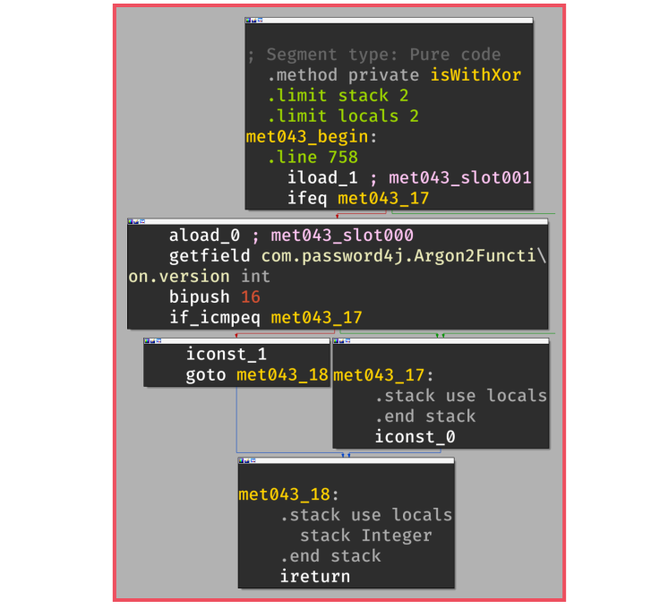

+++
title       = "Control-Flow Obfuscation"
description = "This pass obfuscates the control flow of Java/Kotlin methods."
img_compare = true
icon        = "fa-regular fa-cubes-stacked"
math        = true
+++

Control-Flow Obfuscation


The purpose of this pass is to protect the code of the functions to hinder reverse-engineering.




The control-flow graph of a function is a representation of the *elementary* computational blocks and
the conditions to reach them. This representation is usually an early step in the decompilation process.

For instance, let's consider the `isWithXor` function implemented in the class
[Argon2Function.java](https://github.com/Password4j/password4j/blob/f4f1e778b3a69538f00436da659ac18a8404665f/src/main/java/com/password4j/Argon2Function.java)
of the project [Password4j](https://github.com/Password4j/password4j):

```java
private boolean isWithXor(int pass)
{
    return !(pass == 0 || version == ARGON2_VERSION_10);
}
```

Once compiled, we get this *flat* representation of its bytecode:

```java
private boolean isWithXor(int pass) {
  L0 {
    iload 1
    ifeq L1
    aload 0 // reference to self
    getfield com/password4j/Argon2Function.version:int
    bipush 16
    if_icmpeq L1
    iconst_1
    goto L2
  }
  L1 {
    iconst_0
  }
  L2 {
    ireturn
  }
}
```

The control-flow graph of this function is represented in the following figure in which we can observe
the two conditions that lead to the return of true (`iconst_1`) or false (`iconst_0`)



In the end, decompilers can use this representation to generate code or pseudo code that is close to the original
implementation:


<br />

When the control flow is obfuscated, the output of the decompilation is **less** readable and the logic of the
function takes more time to be reverse-engineered:



<p></p>


O-MVLL provides a similar protection for native code through the following passes:

* [Control-Flow Flattening]()
* [Control-Flow Breaking]()


## When to use it?

You can use this obfuscation pass for methods that have sensitive logic in terms of input/output processing.
Usually, this protection should be enabled class-wide to provide a good level of protection.

In addition, it is usually a good practice to obfuscate functions that are close to your (real) sensitive
function for introducing confusion about where the sensitive logic is located.

In other words, if you obfuscate only one function among several,
reverse engineers will likely focus on this single protected function.

## How to use it?

You can trigger this pass with the option: `-obfuscate-control-flow`:

```bash
-obfuscate-control-flow class class com.password4j.Argon2Function { *; }
-obfuscate-control-flow class class com.dprotect.** { *; }
```

In its current form, this pass takes a class specifier as argument and does not have extra modifiers.
We highly recommend combining this pass with other obfuscation passes like
[Arithmetic Obfuscation]() and
[Constants Obfuscation]().

With these additional passes the previous `isWithXor()` function is more complicated to reverse:



<p></p>

## Implementation

In its current form, this protection works by targeting the `GOTO #offset` instructions.
Basically, the idea is to use an opaque predicate to create an opaque condition on the (unconditional) goto:


<br />

We can target these instructions by using a Proguard's InstructionVisitor in which
we override the `visitBranchInstruction` method:

```java {hl_lines=[4, "13-21"]}
public class ControlFlowObfuscation
implements   ClassVisitor,
             ...,
             InstructionVisitor
{

    @Override
    public void visitAnyInstruction(...)
    {
      /* Do nothing, only target branches */
    }

    @Override
    public void visitBranchInstruction(Clazz             clazz,
                                       Method            method,
                                       CodeAttribute     codeAttribute,
                                       int               offset,
                                       BranchInstruction branch)
    {
    // ...
    }
}
```

Within the `visitBranchInstruction` method, we can filter the `GOTO` instructions and replace them with an
opaque block:

```java
void visitBranchInstruction(...) {
  // Only target GOTO instructions
  if (branch.opcode != Instruction.OP_GOTO) {
      return;
  }

  // Create instructions builder
  // This is more or less the equivalent of llvm::IRBuilder
  InstructionSequenceBuilder ____ =
      new InstructionSequenceBuilder((ProgramClass)clazz);

  // Create the opaque predicate {
  ____.ldc(0x456)
      .ldc(0x123)
      .iadd()
      ...
  // }

  // Create the opaque condition {
  ____.ifne(branch.branchOffset) // <--- ALWAYS TAKEN
      .goto(???)                 // <--- NEVER TAKEN
  // }
}
```

For the opaque predicates, the pass uses well-known equations:

1. $(X + 1) \neq 0 \mod 2$ when $X$ is even
2. $X^2 + X + 7 \neq 0 \mod 81$
2. $7X^2 - 1 - X \neq 0$

These equations are randomly chosen upon a `GOTO` replacement.
Then, this opaque predicate is followed by two created instructions:

```java {hl_lines=[3,4]}
void visitBranchInstruction(...) {
  ...
  ____.ifne(branch.branchOffset)
      .goto(???)
}
```

On the `ifne` instruction, because of the previous opaque predicates that are always returning a non-zero value,
the condition is true and it jumps to the original goto offset: `branch.branchOffset`.

On the other hand, there is still a pending question about the offset of the never-taken `.goto(???)`\?

In a first attempt, we can create (along with the opaque instructions) a new block that would perform
useless computations since it's never reached:

```java {hl_lines=[2,10]}
CodeAttributeEditor.Label OPAQUE_BLOCK = codeAttributeEditor.label();
____.label(OPAQUE_BLOCK)
    .iconst_1()
    .pop()
    .iconst_2()
    .pop();
...

____.ifne(branch.branchOffset)
    .goto(OPAQUE_BLOCK.offset())
```

This approach works well but it has some drawbacks:

###### 1. Overhead

For one goto replaced, the pass introduces:
`sizeof(Opaque Predicate) + sizeof(ifne) + sizeof(goto) + sizeof(OPAQUE_BLOCK)` of new instructions

###### 2. (Non) Confusion

With this approach, the code generated is not *really* confusing for the decompilers and once the opaque predicates
are identified, it would *quite easy* to get rid of them.

Ideally, it could be better to *goto* an already-existing instruction:


<br />


Java is far less permissive than native code for introducing inconsistent code. In particular,
we **can't** jump anywhere in the current method as it could be inconsistent with the expected stack frame.


Because of the Java bytecode verifier,
we can `goto` into an existing offset, **only** where the stack frame and the local frame match the current one.

To better understand this restriction, let's consider the following bytecode in which the last column traces
the status of the stack **after** the instruction:

```java
// int var = 1 + 2;
# | Inst     | Stack (after)
-----------------------------
0 | nop      | -
1 | iconst_1 | Int(1)
2 | iconst_2 | Int(1), Int(2)
3 | iadd     | Int(3)
4 | istore_1 | -
5 | goto +4  | -
```

Since the layout of the stack before executing the `goto +4` is empty, we can only jump to **index 1** where
the stack is also empty.

```java
// int var = 1 + 2;
# | Inst     | Stack (after)
-----------------------------
0 | nop      | -      <---------+
1 | iconst_1 | Int(1)           |
2 | iconst_2 | Int(1), Int(2)   |
3 | iadd     | Int(3)           |
4 | istore_1 | -                |
5 | goto +4  | -         -------+
```

Therefore, to correctly `goto` a valid offset, we must be able to determine the stack frame (and the local frame)
for the different instructions of the bytecode.

This computation can be performed with the
[PartialEvaluator](https://github.com/Guardsquare/proguard-core/blob/8412d509eb11d77cc92e048011c6ea950f22db9e/base/src/main/java/proguard/evaluation/PartialEvaluator.java)
available in ProguardCORE. The purpose of this component and how it works is described in the official
documentation of ProguardCORE:
[Data flow analysis with partial evaluation](https://guardsquare.github.io/proguard-core/partialevaluator.html).

In the context of this obfuscation pass, we are using the PartialEvaluator to identify all the instructions
for which the stack/local frame matches the current one associated with the obfuscated `goto`.
For the details, you can check out the `FrameFinder` class in the file
[ControlFlowObfuscation.java](/blob/main/base/src/main/java/dprotect/obfuscation/controlflow/ControlFlowObfuscation.java).

In the case where we can't find a suitable offset to `goto`, the pass fallback in the creation of an
opaque block (`OPAQUE_BLOCK`).

## Limitations

This pass is currently limited to the `goto` instructions. This means that if the method does not have
at least one `goto`,  the method won't be protected by the pass.

In addition, I guess that the opaque predicates could be pattern-matched and potentially simplified.
Nevertheless, at the time of writing and as far I know, it does not exist public tools/scripts that could be
used to recover the original control flow.

## References

- [Java Control Flow Obfuscation](https://www.cs.auckland.ac.nz/~cthombor/Pubs/dlowthesis.pdf) by Douglas Low (1998)

