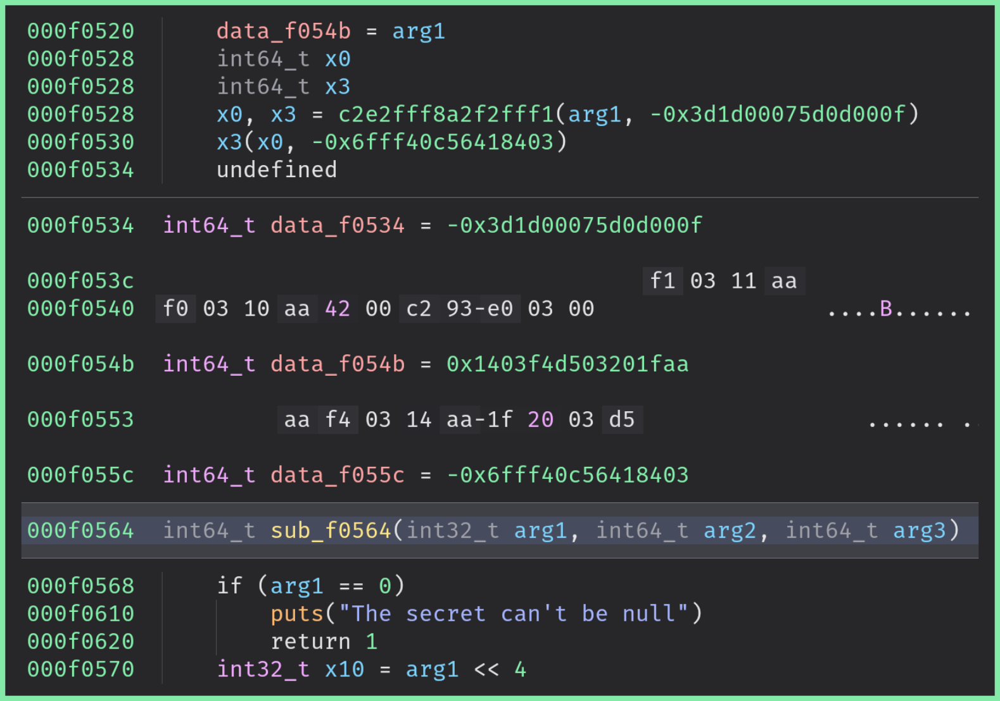
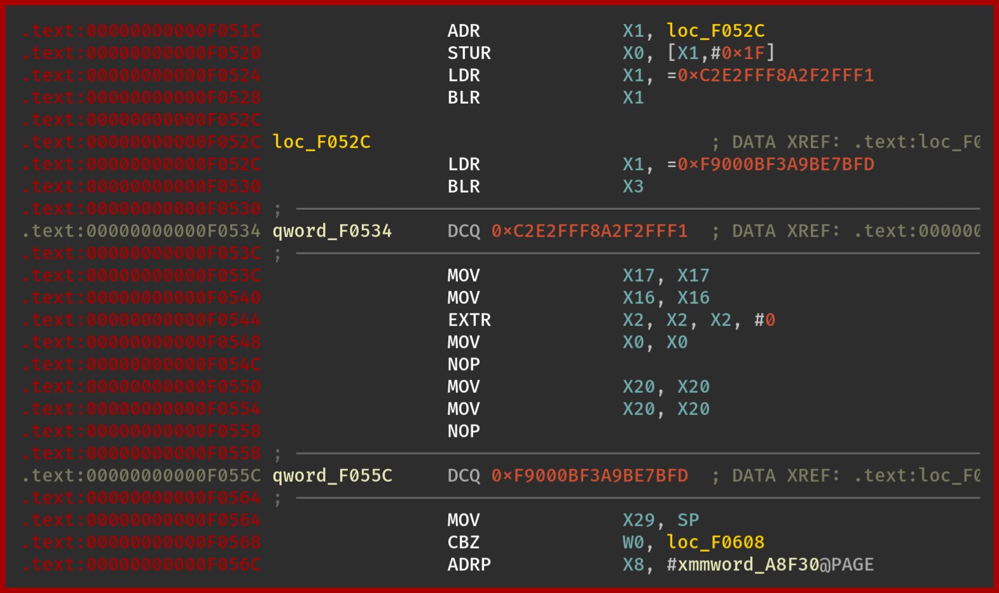
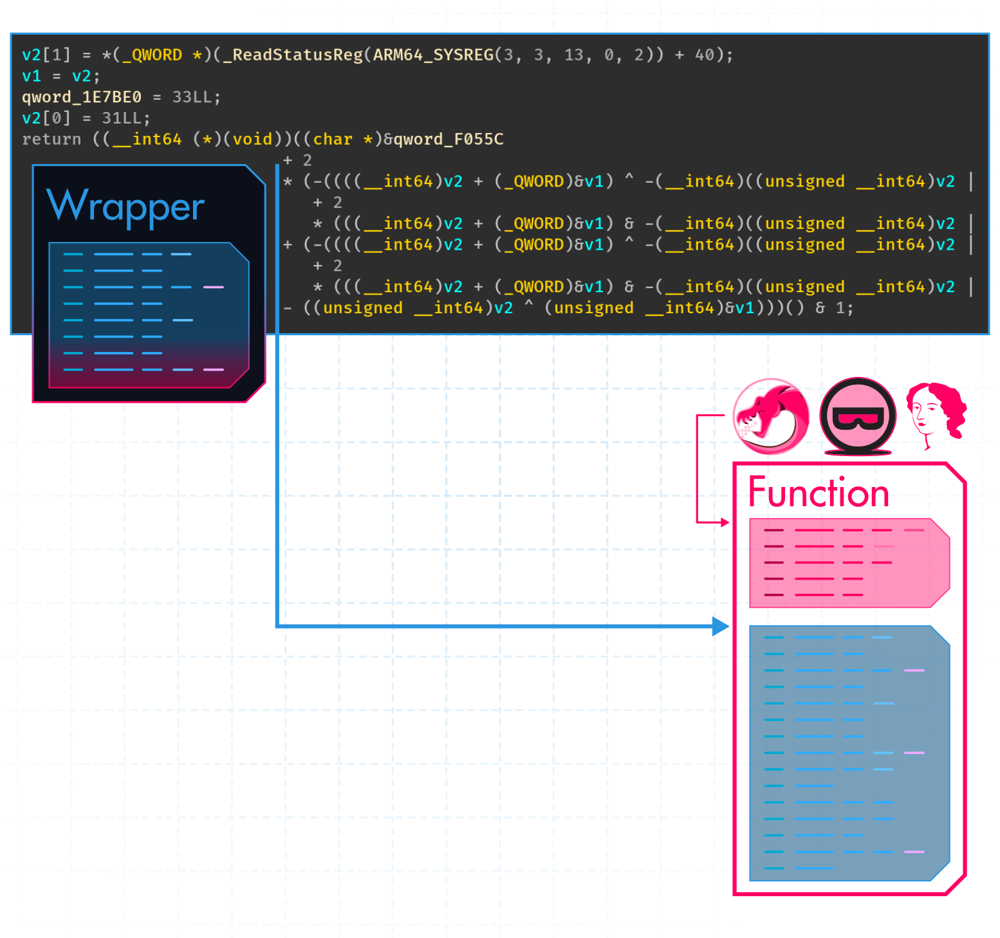

+++
title       = "Control-Flow Breaking"
description = "This pass can be used to break the control-flow representation of disassemblers"
icon        = "fa-regular fa-chart-tree-map"
img_compare = true
+++

Control-Flow Breaking


The purpose of this pass is to break the control-flow representation.




Control-Flow representation is an important piece of information for reverse engineers as it is used to
represent elementary computational block (or basic block) and how they relate to each other.

A large part of the decompilation process relies on such a control flow representation, and the disassembler
will likely fail the decompilation if it does not manage to determine the control-flow graph of the function.

The idea of this pass is to inject custom and non-executing instructions at the beginning of the function
which break and unalign – to some extent – the analysis of the disassemblers.

Here are the results with IDA and BinaryNinja:

#### IDA



#### BinaryNinja



Actually, in BinaryNinja we can recover the original code by manually creating the function where they *are undefined*:



The cross references are still broken though.


The output of Ghidra is very close to BinaryNinja: without a manual action, Ghidra fails to represent the function.

<br />
With manual actions, Ghidra manages to recover the function but misses the first instructions (stack allocation).



## When to use it?

If you consider that a function is sensitive, you may want to enable this pass. This protection has the
advantage to introduce a **very low overhead** on the execution and the binary's size while being pretty efficient
against decompilation and static analysis.


## How to use it?

We can trigger this pass by defining the function `break_control_flow` in the configuration class:

```python {hl_lines=3}
class Config(omvll.ObfuscationConfig):

    def break_control_flow(self, mod: omvll.Module, func: omvll.Function):
        if func.demangled_name.startswith("break_control_flow"):
            return True
        return False
```

## Implementation

This obfuscation pass works in three steps:

1. Clone the original function
2. Inject a custom-breaking prologue in the **cloned** function
3. Remove all the instructions of the **original** function and write a stub to jump after
   the custom prologue (i.e. the original instruction)

These steps are summarized in the following figure:




##### 1. Cloning

First, we need to clone the original function since we want to create a custom jump after the breaking prologue:

```cpp {hl_lines=3}
bool BreakControlFlow::runOnFunction(Function &F) {
  ValueToValueMapTy VMap;
  Function* FCopied = CloneFunction(&F, VMap, nullptr);
}
```

##### 2. Injecting

Then, all the efficiency of this obfuscation pass relies on injecting a custom assembly prologue
that should confuse disassemblers.

In its current form, the pass injects a prologue similar to this code:

```armasm
adr x1, #0x10;
ldr x0, [x1, #31];
ldr x1, #16;
blr x1;
ldr x1, #48;
blr x3;
.byte 0xF1, 0xFF, 0xF2, 0xA2;
.byte 0xF8, 0xFF, 0xE2, 0xC2;
```

The first instructions are used to make believe that the code is consistent while the last `.byte` "*instructions*"
are used to break this consistency.

Within the consistent instructions, there is a bunch of `ldr x0, #offset` [^note_ldr] which are used to confuse
the disassembler about the type of the data at the given pc-relative `#offset`.

`ldr x0, #offset` would load data at `pc + #offset` which likely points in the code of the function to protect.
Therefore, the disassembler might consider that the content at this address is not an instruction, while it is.

This is the reason why in IDA, we have this broken representation of the function:



The custom prologue is Jitted with the same mechanism as described in the
[Anti-Hooking](#implementation) pass:

```cpp
auto jitter = Jitter::Create(F.getParent()->getTargetTriple());
std::unique_ptr<MemoryBuffer> insts = jitter_->jitAsm(R"delim(
adr x1, #0x10;
ldr x0, [x1, #61];
ldr x1, #16;
blr x1;
ldr x1, #48;
blr x3;
.byte 0xF1, 0xFF, 0xF2, 0xA2;
.byte 0xF8, 0xFF, 0xE2, 0xC2;
)delim");


FCopied->setPrologueData(insts);
```

##### 3. Jumping

Once we have injected the custom prologue, we must replace the instructions of the original function with
a jump right after the injected prologue.

Using the LLVM IR, we can get a "pointer" to the cloned function using the `CreatePtrToInt` instruction:

```cpp {hl_lines=2}
IRBuilder<NoFolder> IRB(Entry);
IRB.CreatePtrToInt(FCopied, IRB.getInt64Ty());
```

Then, we can add the offset of the prologue to this value:


```cpp {hl_lines="2-3"}
IRBuilder<NoFolder> IRB(Entry);
IRB.CreateAdd(IRB.CreatePtrToInt(FCopied, IRB.getInt64Ty()),
              ConstantInt::get(IRB.getInt64Ty(), PrologueSize));
```

Finally, we can create a call:

```cpp {hl_lines="5-6"}
IRBuilder<NoFolder> IRB(Entry);
IRB.CreateAdd(IRB.CreatePtrToInt(FCopied, IRB.getInt64Ty()),
              ConstantInt::get(IRB.getInt64Ty(), PrologueSize));

Value* FPtr = IRB.CreatePointerCast(FAddr, FCopied->getFunctionType());
IRB.CreateRet(IRB.CreateCall(FCopied->getFunctionType(), FPtr, args));
```
Without any additional protections, the indirect call `&FCopied + PrologueSize` would be resolved by the
disassemblers which can strongly weaken the protection.

To prevent this resolution, we are applying MBA and opaque constants thanks to the
[annotations]() mechanism:

```cpp {hl_lines="5-6"}
Value* DstAddr = IRB.CreateAdd(OpaqueFAddr,
                               ConstantInt::get(IRB.getInt64Ty(), PrologueSize));

if (auto* Op = dyn_cast<Instruction>(DstAddr)) {
  addMetadata(*Op, {MetaObf(OPAQUE_OP, 2llu),
                    MetaObf(OPAQUE_CST)});
}
```

In the end, the wrapper looks like this:



## Limitations

#### Small functions

As already mentioned, this pass could be defeated with manual actions on the inconsistent code. In addition,
the disassemblers might improve their heuristics in future versions which would make this pass less efficient.

There is also a limitation for small functions as the injected prologue assumes that `pc + {16, 48, ...}`
points in the function to protect.
If the function is too small, these offsets might point in a function next to the targeted one.

[^note_ldr]: This instruction loads the content at `pc + #offset`

#### iOS Swift generated functions

The Swift compiler may introduce helper functions / thunks – which use different calling conventions –, in ways that are not visible at the source level. If BreakControlFlow pass is applied to these compiler-generated routines, it may cause duplicate symbol errors or violate the expected calling convention.

In order to prevent such issues, restrict the pass to user-defined functions only.